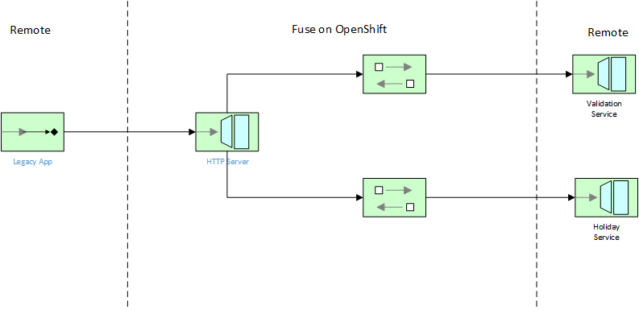

<h1 align="center">XML REST API<br/>using Fuse on Openshift</h1>

This project demonstrates a RESTful XML API using the Hystrix Circuit Breaker patterns:



Setup
==============================

- Install JDK 1.8+
- Install Apache Maven 3.3+ [http://maven.apache.org]

Build & Run Locally
==============================

1. Build this project so bundles are deployed into your local maven repo

```
<project home> $ mvn clean install
```
2. Run locally via SpringBoot

```
<project home>  $ mvn spring-boot:run -Dspring.cloud.kubernetes.enabled=false
```
3. Test sending a sample request

You can experiment using different countries and years.  If validation fails, the circuit break should trip and return a human-readable error message.

Valid request:

```
curl 'http://localhost:9090/countryHolidayLookup?country=UnitedStates&year=2011' -H "Content-Type: text/xml"
```

Invalid request (fails country validation):

```
curl 'http://localhost:9090/countryHolidayLookup?country=Australia&year=2011' -H "Content-Type: text/xml"
```

Build, Deploy and Run on OpenShift
==============================

Now that everything is running perfectly in your local environment, let's try deploying our SpringBoot container to OpenShift using the s2i binary method.

1. Login via the CLI using `oc login -u YOURUSERID`.
2. Create your demo workspace project `oc create project xml-apis`
3. Via the CLI, cd to the `xml-api-failover` directory and execute `mvn clean fabric8:deploy`.
4. To setup the Hystrix dashboard, execute the following via the CLI:

```
oc create -f http://repo1.maven.org/maven2/io/fabric8/kubeflix/hystrix-dashboard/1.0.28/hystrix-dashboard-1.0.28-openshift.yml
oc expose service hystrix-dashboard --port=8080
```
5. Once the Hystrix dashboard has started, you can enter `http://country-holiday-lookup.xml-apis.svc:8080/hystrix.stream` as the turbine stream.  You should now be able to view the Camel circuits.
6. Try testing using curl or SOAPUI, playing with valid and invalid requests.  Notice the circuit breaker behavior i.e. opening and closing, whenever there is a fault.